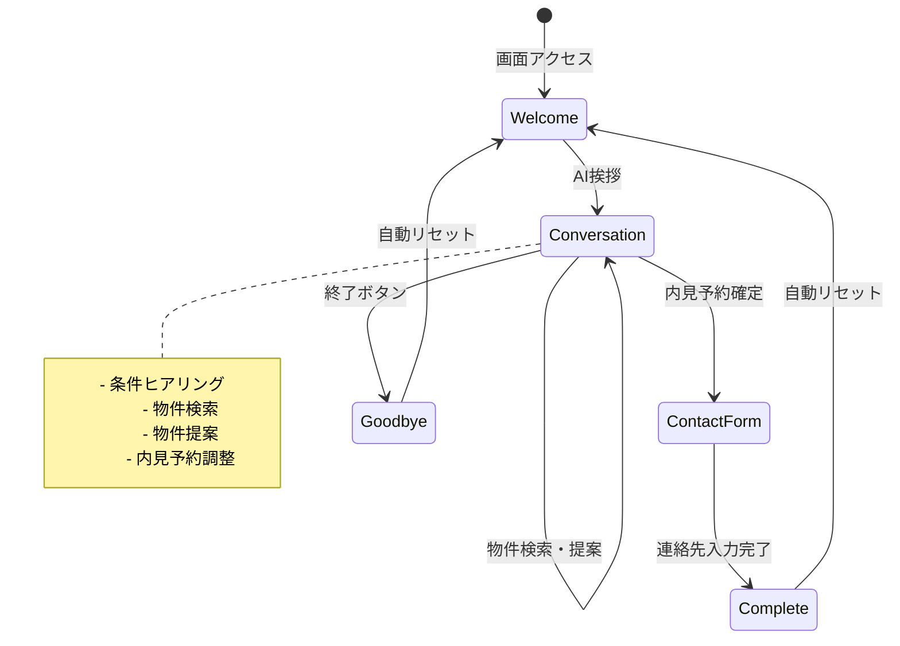
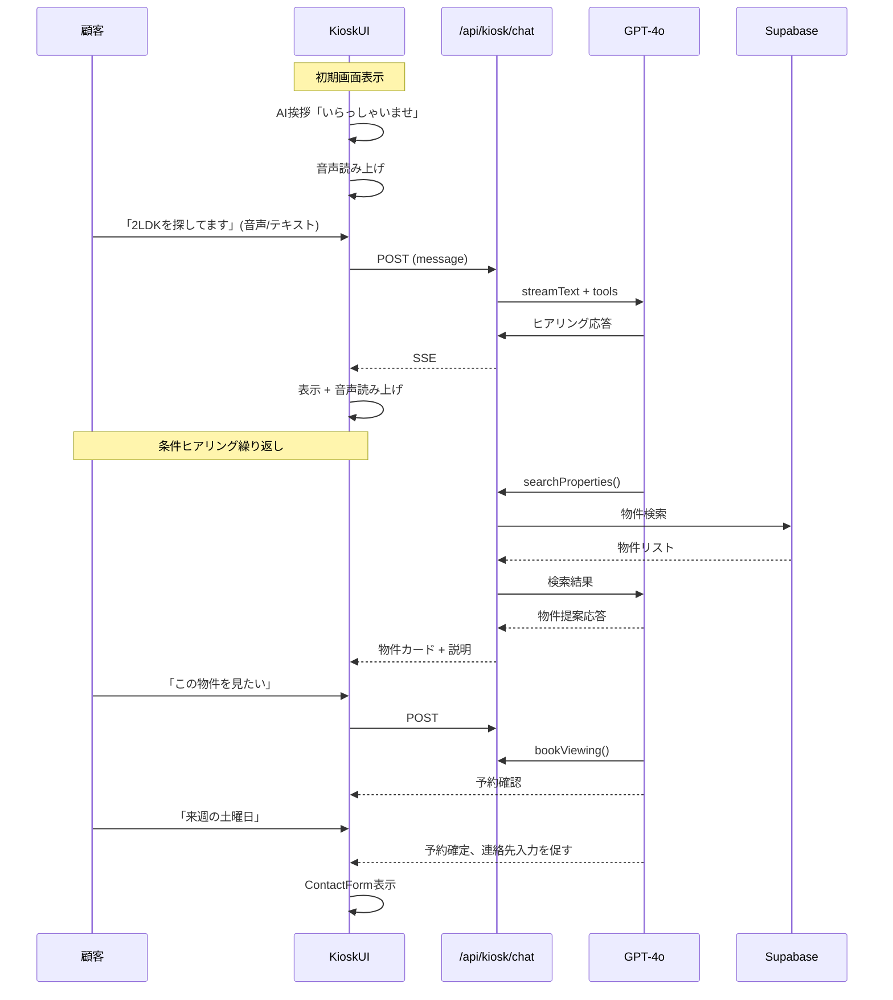
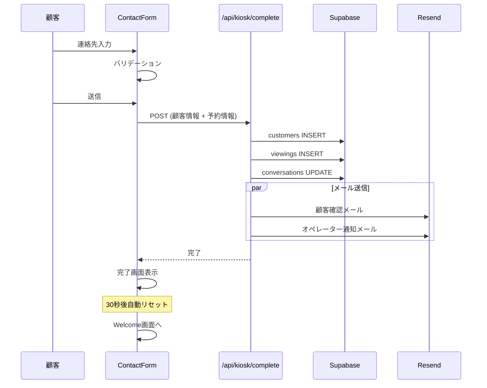

# Design Document

## Overview

**Purpose**: 不動産店舗に設置するAI接客キオスク。顧客は会話だけで物件検索から内見予約まで完結し、連絡先を入力して終了する。

**Users**: 店舗来店客（ログイン不要、認証不要）

**Impact**: 営業担当者不在時も24時間顧客対応が可能になり、機会損失を防ぐ。

### Goals
- 会話のみで物件検索〜内見予約〜連絡先収集を完結
- 高齢者にも使いやすい音声対話（音声入力ボタンを画面中央に大きく配置）
- 段階的な条件ヒアリング（一度に全条件を言えなくてもOK）
- 物件スロットUIで候補物件を可視化
- シンプルな1画面UI
- セッション完了後の自動リセット

### Non-Goals
- 顧客アカウント管理
- 顧客向けの設定画面
- 会話履歴の顧客向け閲覧機能
- 契約・決済処理

## Architecture

### System Components

```
┌─────────────────────────────────────────────────────────────────┐
│                    店舗設置タブレット/PC                         │
│                                                                   │
│  ┌─────────────────────────────────────────────────────────────┐ │
│  │                    KioskInterface                           │ │
│  │  ┌─────────────┐  ┌──────────────────────────────────────┐ │ │
│  │  │             │  │         メッセージリスト              │ │ │
│  │  │  アバター    │  │                                      │ │ │
│  │  │  (感情表現)  │  ├──────────────────────────────────────┤ │ │
│  │  │             │  │     物件スロット（候補物件表示）       │ │ │
│  │  │             │  │  [物件1] [物件2] [物件3] ...          │ │ │
│  │  └─────────────┘  └──────────────────────────────────────┘ │ │
│  │  ┌─────────────────────────────────────────────────────────┐│ │
│  │  │                                                         ││ │
│  │  │              [  🎤  大きな音声ボタン  ]                 ││ │
│  │  │                                                         ││ │
│  │  │  [___テキスト入力___] [送信]                  [終了]    ││ │
│  │  └─────────────────────────────────────────────────────────┘│ │
│  └─────────────────────────────────────────────────────────────┘ │
│                                                                   │
│  ┌─────────────────────────────────────────────────────────────┐ │
│  │  ContactForm (内見予約確定時のみ表示)                       │ │
│  │  名前: [________] 電話: [________] メール: [________]       │ │
│  └─────────────────────────────────────────────────────────────┘ │
└───────────────────────────────────────────────────────────────────┘
                              │
                              ▼
┌───────────────────────────────────────────────────────────────────┐
│                    Next.js API Routes                             │
│  ┌─────────────┐  ┌─────────────┐  ┌─────────────────────────┐   │
│  │ /api/kiosk/ │  │ /api/voice/ │  │ /api/kiosk/complete     │   │
│  │ chat        │  │ transcribe  │  │ (予約確定+顧客登録)     │   │
│  │             │  │ synthesize  │  │                         │   │
│  └─────────────┘  └─────────────┘  └─────────────────────────┘   │
└───────────────────────────────────────────────────────────────────┘
                              │
          ┌───────────────────┼───────────────────┐
          │                   │                   │
          ▼                   ▼                   ▼
┌─────────────────┐ ┌─────────────────┐ ┌─────────────────────────┐
│   Google        │ │   Supabase      │ │   Resend                │
│   Gemini 2.5    │ │   Database      │ │   メール送信            │
│   Flash         │ │   (認証なし)    │ │                         │
├─────────────────┤ │                 │ │                         │
│   OpenAI        │ │                 │ │                         │
│   Whisper       │ │                 │ │                         │
│   Embeddings    │ │                 │ │                         │
└─────────────────┘ └─────────────────┘ └─────────────────────────┘
```

### Technology Stack

| Layer | Choice | Role |
|-------|--------|------|
| Frontend | React 19 + Next.js 15 | キオスクUI |
| AI Chat | Vercel AI SDK + Gemini 2.5 Flash | 会話生成、Function Calling |
| Voice | OpenAI Whisper + Google Cloud TTS | 音声入出力 |
| Database | Supabase (Service Role) | データ保存（認証なし） |
| Email | Resend | 確認メール送信 |
| State | Zustand | セッション状態管理 |

## System Flows

### メインフロー



### 会話フロー詳細



### 予約完了フロー



## Components and Interfaces

### Frontend Components

#### KioskInterface
| Field | Detail |
|-------|--------|
| Intent | キオスク全体のコンテナ |
| Requirements | 1, 5, 7 |

**状態管理**
```typescript
interface KioskState {
  phase: 'welcome' | 'conversation' | 'contact' | 'complete' | 'goodbye';
  sessionId: string;
  messages: Message[];
  // 物件スロット: 会話で追加/絞り込みされる候補物件リスト
  propertySlots: Property[];
  selectedProperty: Property | null;
  viewingDate: Date | null;
  // 段階的に収集される条件
  collectedCriteria: {
    areas?: string[];
    budgetMin?: number;
    budgetMax?: number;
    layouts?: string[];
    buildingTypes?: string[];
    stations?: string[];
    amenities?: string[];
  };
}
```

#### AvatarDisplay
| Field | Detail |
|-------|--------|
| Intent | AIアバターと感情表現 |
| Requirements | 6 |

#### ConversationPanel
| Field | Detail |
|-------|--------|
| Intent | 会話履歴と物件カード表示 |
| Requirements | 1, 2 |

#### PropertySlots
| Field | Detail |
|-------|--------|
| Intent | 候補物件のスロット表示（追加・絞り込み） |
| Requirements | 2 |

**Props**
```typescript
interface PropertySlotsProps {
  properties: Property[];
  selectedId: string | null;
  onSelect: (property: Property) => void;
  onRemove: (propertyId: string) => void;
}
```

**動作**
- AIが物件を検索すると、スロットに物件が追加される
- 顧客が条件を追加すると、スロット内の物件が絞り込まれる
- 顧客が物件を選択すると、AIがその物件について詳しく説明する
- 横スクロール可能なカルーセル形式で表示

#### VoiceInput
| Field | Detail |
|-------|--------|
| Intent | 音声録音とテキスト変換 |
| Requirements | 1 |

#### ContactForm
| Field | Detail |
|-------|--------|
| Intent | 連絡先入力フォーム |
| Requirements | 4 |

**Fields**
```typescript
interface ContactFormData {
  name: string;
  phone: string;
  email: string;
}
```

#### CompletionScreen
| Field | Detail |
|-------|--------|
| Intent | 予約完了画面 |
| Requirements | 5 |

### API Routes

#### POST /api/kiosk/chat

認証なしでアクセス可能なキオスク専用チャットAPI

**Request**
```typescript
interface KioskChatRequest {
  session_id: string;
  operator_id: string;  // 店舗識別用（URL等から取得）
  message: string;
  context?: {
    selected_property_id?: string;
    viewing_date?: string;
  };
}
```

**Response**: SSE Stream
```
data: {"type":"text","content":"..."}
data: {"type":"emotion","emotion":"happy"}
data: {"type":"criteria_update","criteria":{...}}
data: {"type":"properties_add","properties":[...]}
data: {"type":"properties_refine","property_ids":[...]}
data: {"type":"property_select","property":{...}}
data: {"type":"booking_confirm","property_id":"...","date":"..."}
data: {"type":"request_contact"}
data: {"type":"done"}
```

**会話パターン例**
```
顧客: 「文京区で探してます」
AI: [addPropertyCriteria] → 物件スロットに文京区の物件を追加
AI: 「文京区ですね。ご予算はいくらくらいをお考えですか？」

顧客: 「15万円くらいまでで」
AI: [refineCriteria] → 15万円以下に絞り込み
AI: 「15万円以下ですと、こちらの5件がございます。間取りのご希望はありますか？」

顧客: 「2LDKがいいな」
AI: [refineCriteria] → 2LDKに絞り込み
AI: 「2LDKですと3件ございます。こちらの駅近物件はいかがでしょうか？」

顧客: (物件スロットから物件を選択)
AI: [selectProperty] → 詳細を表示
AI: 「こちらは茗荷谷駅から徒歩5分の築浅マンションです...」
```

#### POST /api/kiosk/complete

予約確定と顧客情報登録

**Request**
```typescript
interface CompleteRequest {
  session_id: string;
  operator_id: string;
  customer: {
    name: string;
    phone: string;
    email: string;
  };
  viewing: {
    property_id: string;
    viewing_date: string;
  };
}
```

**Response**
```json
{
  "success": true,
  "data": {
    "customer_id": "uuid",
    "viewing_id": "uuid",
    "message": "ご予約ありがとうございます"
  }
}
```

### AI Tools (Function Calling)

```typescript
const kioskTools = {
  // 条件を追加して物件スロットに追加
  addPropertyCriteria: {
    description: '顧客の希望条件を追加し、マッチする物件をスロットに追加',
    parameters: z.object({
      areas: z.array(z.string()).optional(),
      rent_min: z.number().optional(),
      rent_max: z.number().optional(),
      layouts: z.array(z.string()).optional(),
      building_types: z.array(z.string()).optional(),
      stations: z.array(z.string()).optional(),
      amenities: z.array(z.string()).optional(),
    }),
  },

  // 条件を変更してスロット内の物件を絞り込み
  refineCriteria: {
    description: '既存の条件を変更し、スロット内の物件を絞り込む',
    parameters: z.object({
      areas: z.array(z.string()).optional(),
      rent_min: z.number().optional(),
      rent_max: z.number().optional(),
      layouts: z.array(z.string()).optional(),
      building_types: z.array(z.string()).optional(),
      stations: z.array(z.string()).optional(),
      amenities: z.array(z.string()).optional(),
    }),
  },

  // スロットから物件を選択して詳細を表示
  selectProperty: {
    description: '物件を選択して詳細情報を表示',
    parameters: z.object({
      property_id: z.string(),
    }),
  },

  // 内見予約を提案
  proposeViewing: {
    description: '選択中の物件の内見予約を提案',
    parameters: z.object({
      property_id: z.string(),
    }),
  },

  // 内見予約を確定（連絡先入力を促す）
  confirmViewing: {
    description: '内見予約を確定（連絡先入力を促す）',
    parameters: z.object({
      property_id: z.string(),
      viewing_date: z.string(),
    }),
  },
};
```

## Data Models

### Session (一時的)
```typescript
interface KioskSession {
  id: string;
  operator_id: string;
  started_at: Date;
  messages: Message[];
  selected_property?: Property;
  viewing_date?: Date;
  customer?: Customer;
  status: 'active' | 'completed' | 'abandoned';
}
```

### Conversation (DB保存)
```typescript
interface Conversation {
  id: string;
  operator_id: string;
  customer_id?: string;  // 連絡先入力後に設定
  session_type: 'kiosk';
  started_at: Date;
  ended_at?: Date;
  outcome: 'viewing_booked' | 'browsing_only' | 'abandoned';
}
```

## Security Considerations

- **認証なし**: キオスク端末は認証不要（Service Role Key使用）
- **operator_id**: URL/環境変数から取得し、データ分離
- **レート制限**: IP + session_idでレート制限
- **入力サニタイズ**: 電話番号・メールアドレスのバリデーション
- **セッションタイムアウト**: 10分操作なしでリセット

## Error Handling

### 会話エラー
- Gemini APIエラー → 「申し訳ございません、もう一度お話しください」
- 物件検索0件 → 条件緩和を提案

### フォームエラー
- バリデーションエラー → フィールドハイライト
- 送信失敗 → リトライボタン

## Testing Strategy

### Unit Tests
- ContactForm: バリデーション
- AI Tools: パラメータ検証

### Integration Tests
- 会話フロー全体
- 予約完了フロー

### E2E Tests
- 初期画面 → 物件検索 → 内見予約 → 連絡先入力 → 完了 → リセット

## Performance Considerations

- セッションタイムアウト: 10分
- 完了画面自動リセット: 30秒
- 音声キャッシュ: よく使うフレーズをキャッシュ
