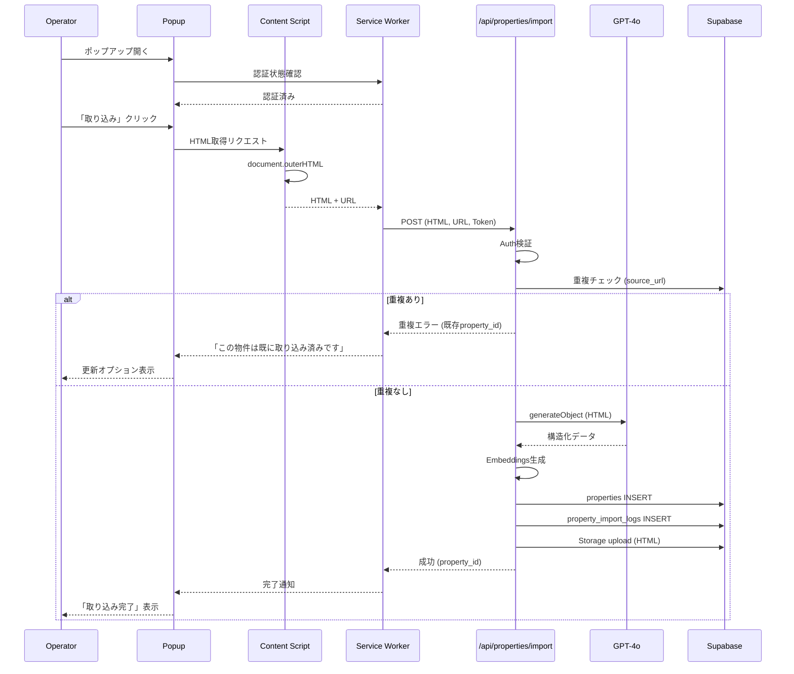

# Design Document

## Overview

**Purpose**: 不動産ポータルサイトから物件情報をワンクリックで取り込み、GPT-4oで構造化データを抽出する。

**Users**: オペレーター（不動産会社）がChrome上で使用

### Goals
- ワンクリックでの物件取り込み
- 高精度な構造化データ抽出
- 法的証跡としてのHTML保存
- シームレスな認証

### Non-Goals
- 自動巡回・スクレイピング
- 他ブラウザ対応
- 画像のダウンロード（URLのみ参照）

## Architecture

### System Components

```
┌─────────────────────────────────────────────────────────────────┐
│                      Chrome Browser                              │
│                                                                   │
│  ┌─────────────────┐      ┌─────────────────────────────────┐   │
│  │   Popup         │      │   Content Script                │   │
│  │   (React)       │      │   (DOM Access)                  │   │
│  │   - Login UI    │      │   - HTML抽出                    │   │
│  │   - Import Btn  │      │   - サイト判定                  │   │
│  └────────┬────────┘      └──────────────┬──────────────────┘   │
│           │                              │                       │
│           ▼                              ▼                       │
│  ┌───────────────────────────────────────────────────────────┐  │
│  │              Background Service Worker                     │  │
│  │              - Auth管理                                    │  │
│  │              - API通信                                     │  │
│  │              - メッセージング                               │  │
│  └────────────────────────────┬──────────────────────────────┘  │
└───────────────────────────────┼─────────────────────────────────┘
                                │
                                ▼
┌───────────────────────────────────────────────────────────────────┐
│                    POST /api/properties/import                    │
│                                                                   │
│  1. Auth検証                                                      │
│  2. GPT-4o構造化データ抽出                                        │
│  3. Embeddings生成                                                │
│  4. DB保存 (properties, property_import_logs)                    │
│  5. HTML保存 (Supabase Storage)                                  │
└───────────────────────────────────────────────────────────────────┘
```

### Technology Stack

| Component | Choice | Role |
|-----------|--------|------|
| Extension | Manifest V3 | Chrome拡張 |
| Popup UI | React + Vite | UIレンダリング |
| Content Script | TypeScript | DOM操作 |
| Service Worker | TypeScript | バックグラウンド処理 |
| API | Next.js Route Handler | 取り込み処理 |
| AI | OpenAI GPT-4o | 構造化抽出 |
| Storage | Supabase Storage | HTMLスナップショット |

## System Flows

### 物件取り込みフロー



**重複取り込み防止**
- `source_url` で重複チェック（オペレーターごと）
- 重複時は既存物件の更新オプションを提示
- `property_import_logs` で取り込み履歴を追跡

## Components and Interfaces

### Chrome Extension

#### manifest.json
```json
{
  "manifest_version": 3,
  "name": "madoguchi-ai Property Importer",
  "version": "1.0.0",
  "permissions": [
    "activeTab",
    "storage"
  ],
  "host_permissions": [
    "https://www.athome.co.jp/*",
    "https://suumo.jp/*"
  ],
  "background": {
    "service_worker": "background.js"
  },
  "content_scripts": [{
    "matches": [
      "https://www.athome.co.jp/*",
      "https://suumo.jp/*"
    ],
    "js": ["content.js"]
  }],
  "action": {
    "default_popup": "popup.html"
  }
}
```

#### Content Script Interface
```typescript
interface ImportRequest {
  type: 'IMPORT_PROPERTY';
}

interface ImportResponse {
  success: boolean;
  html: string;
  url: string;
}
```

#### Background Service Worker
```typescript
interface AuthState {
  isAuthenticated: boolean;
  accessToken?: string;
  user?: { id: string; email: string; role: string };
}
```

### API Route

#### POST /api/properties/import

**Request**
```typescript
interface ImportRequest {
  html: string;
  url: string;
  force_update?: boolean;  // 重複時に強制更新
}
```

**Response (新規取り込み成功)**
```json
{
  "success": true,
  "data": {
    "property_id": "uuid",
    "import_log_id": "uuid",
    "is_new": true,
    "message": "物件を取り込みました"
  }
}
```

**Response (重複検出)**
```json
{
  "success": false,
  "error": {
    "code": "DUPLICATE_PROPERTY",
    "message": "この物件は既に取り込み済みです",
    "existing_property_id": "uuid",
    "imported_at": "2025-01-15T10:30:00Z"
  }
}
```

**Response (強制更新成功)**
```json
{
  "success": true,
  "data": {
    "property_id": "uuid",
    "import_log_id": "uuid",
    "is_new": false,
    "message": "物件を更新しました"
  }
}
```

### GPT-4o Schema

```typescript
const PropertySchema = z.object({
  title: z.string(),
  address: z.string(),
  area: z.string(),
  transaction_type: z.enum(['rent', 'sale']),
  rent: z.number().optional(),
  sale_price: z.number().optional(),
  layout: z.string(),
  building_type: z.string(),
  floor_area: z.number().optional(),
  station: z.string().optional(),
  distance_from_station: z.number().optional(),
  description: z.string().optional(),
  amenities: z.record(z.boolean()).optional(),
});
```

## Data Models

### properties (source_url追加)
```typescript
interface Property {
  // ... 既存フィールド
  source_url?: string;  // 取り込み元URL（重複チェック用）
}
```

### property_import_logs
```typescript
interface PropertyImportLog {
  id: string;
  property_id: string | null;
  operator_id: string;
  source_url: string;
  html_snapshot_path: string;
  imported_by: string;
  imported_at: Date;
  import_method: 'chrome_extension';
  status: 'success' | 'failed' | 'pending' | 'duplicate_updated';
  is_update: boolean;  // 更新取り込みかどうか
  error_message?: string;
}
```

### Database Constraints
```sql
-- オペレーターごとに source_url をユニークに（重複取り込み防止）
CREATE UNIQUE INDEX idx_properties_source_url_operator
ON properties(operator_id, source_url)
WHERE source_url IS NOT NULL;
```

## Security Considerations

- **認証**: Supabase Auth JWT検証
- **権限**: operator/admin のみ取り込み可能
- **入力検証**: HTMLサイズ制限（5MB）
- **CSP**: Content Security Policy設定
- **Storage**: Private bucket（認証必須）

## Error Handling

### Extension Errors
- 未認証 → ログインページへ誘導
- 非対応サイト → エラーメッセージ
- ネットワークエラー → リトライオプション

### API Errors
- 認証エラー (401) → 再認証要求
- 権限エラー (403) → エラーメッセージ
- 重複エラー (409) → 更新オプション提示
- GPT抽出失敗 → 手動入力フォームへフォールバック

## Testing Strategy

### Unit Tests
- Content Script: HTML抽出
- Service Worker: メッセージング

### Integration Tests
- Popup → Content Script → Service Worker 連携
- API: 構造化抽出

### E2E Tests
- 実際の不動産サイトで取り込みテスト
