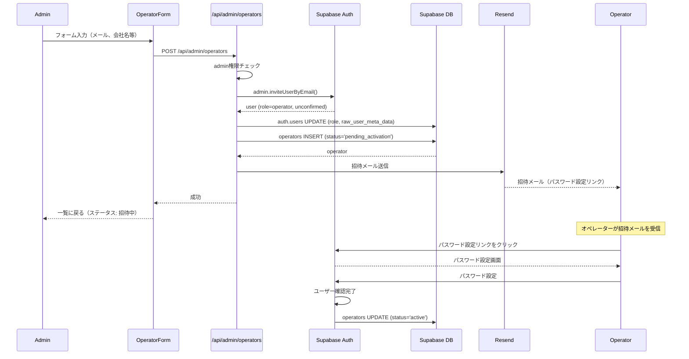

# Design Document

## Overview

**Purpose**: システム管理者がオペレーター（不動産会社）を管理し、システム全体を監視する機能。

**Users**: システム管理者（gyam様）のみ

### Goals
- オペレーターのライフサイクル管理
- サブスクリプション管理
- システム全体の可視化
- 監査ログ

### Non-Goals
- 課金・決済処理（外部システム）
- 自動サブスクリプション更新

## Architecture

### System Components

```
┌─────────────────────────────────────────────────────────────────┐
│                    Admin Dashboard                               │
│  ┌─────────────────┐  ┌─────────────────┐  ┌────────────────┐  │
│  │ OperatorList    │  │ OperatorDetail  │  │ SystemStats    │  │
│  │ (Table)         │  │ (Edit Form)     │  │ (Charts)       │  │
│  └────────┬────────┘  └────────┬────────┘  └───────┬────────┘  │
└───────────┼──────────────────────┼─────────────────┼────────────┘
            │                      │                 │
            ▼                      ▼                 ▼
┌──────────────────────────────────────────────────────────────────┐
│                    Next.js API Routes                            │
│  ┌──────────────────┐  ┌──────────────────┐  ┌────────────────┐  │
│  │ /api/admin/      │  │ /api/admin/      │  │ /api/admin/    │  │
│  │ operators        │  │ operators/[id]   │  │ stats          │  │
│  └──────────────────┘  └──────────────────┘  └────────────────┘  │
└───────────────────────────────┬──────────────────────────────────┘
                                │
                                ▼
┌──────────────────────────────────────────────────────────────────┐
│                    Supabase                                      │
│  ┌──────────────┐  ┌──────────────┐  ┌────────────────────────┐  │
│  │ operators    │  │ auth.users   │  │ properties, customers  │  │
│  │              │  │ (role=operator)│ │ (for stats)           │  │
│  └──────────────┘  └──────────────┘  └────────────────────────┘  │
└──────────────────────────────────────────────────────────────────┘
```

### Technology Stack

| Component | Choice | Role |
|-----------|--------|------|
| Frontend | React 19 + Next.js 15 | 管理画面 |
| UI | shadcn/ui + TanStack Table | テーブル、フォーム |
| Charts | Recharts | 統計グラフ |
| Auth | Supabase Auth | 管理者認証 |
| Database | Supabase PostgreSQL | データ |

## System Flows

### オペレーター登録フロー（招待メール方式）

管理者がオペレーターを登録すると、招待メールが送信され、オペレーター自身がパスワードを設定するフロー。



**ポイント**
- 管理者はパスワードを設定しない（セキュリティ向上）
- `admin.inviteUserByEmail()` で招待メール自動送信
- オペレーターは自分でパスワードを設定
- 招待メールの有効期限: 24時間
- 招待中のオペレーターは `pending_activation` ステータス

## Components and Interfaces

### Frontend Components

#### OperatorList
| Field | Detail |
|-------|--------|
| Intent | オペレーター一覧テーブル |
| Requirements | 2 |

**Features**
- ソート（会社名、作成日、ステータス）
- フィルター（ステータス）
- 検索（会社名）
- ページネーション

#### OperatorForm
| Field | Detail |
|-------|--------|
| Intent | オペレーター登録・編集フォーム |
| Requirements | 1, 3 |

**Fields**
```typescript
interface OperatorFormData {
  email: string;
  // パスワードは不要（招待メールでオペレーター自身が設定）
  company_name: string;
  company_address?: string;
  phone?: string;
  subscription_plan: 'basic' | 'standard' | 'premium';
  subscription_status: 'active' | 'suspended' | 'cancelled' | 'trial' | 'pending_activation';
  contract_start_date: Date;
  contract_end_date?: Date;
  is_active: boolean;
}
```

#### SystemStats
| Field | Detail |
|-------|--------|
| Intent | システム統計ダッシュボード |
| Requirements | 5 |

**Stats**
- オペレーター数（状態別）
- 物件数
- 顧客数
- 会話数（直近30日）

### API Routes

#### GET /api/admin/operators

**Query Parameters**
| Param | Type | Description |
|-------|------|-------------|
| subscription_status | string | ステータスフィルター |
| is_active | boolean | 有効状態フィルター |
| search | string | 会社名検索 |
| page | number | ページ番号 |
| limit | number | 取得件数 |

**Response**
```json
{
  "success": true,
  "data": {
    "operators": [
      {
        "id": "uuid",
        "company_name": "〇〇不動産",
        "subscription_status": "active",
        "stats": {
          "property_count": 150,
          "customer_count": 45
        }
      }
    ],
    "pagination": { "total": 50, "page": 1 }
  }
}
```

#### POST /api/admin/operators

招待メール方式でオペレーターを登録。パスワードは不要。

**Request**
```json
{
  "email": "operator@example.com",
  "company_name": "〇〇不動産株式会社",
  "company_address": "東京都文京区...",
  "phone": "03-1234-5678",
  "subscription_plan": "standard",
  "contract_start_date": "2025-01-15"
}
```

**Response**
```json
{
  "success": true,
  "data": {
    "operator_id": "uuid",
    "status": "pending_activation",
    "invitation_sent": true,
    "message": "招待メールを送信しました"
  }
}
```

#### POST /api/admin/operators/[id]/resend-invitation

招待メールを再送信（有効期限切れ時など）

**Response**
```json
{
  "success": true,
  "data": {
    "message": "招待メールを再送信しました"
  }
}
```

#### PATCH /api/admin/operators/[id]

**Request**
```json
{
  "company_name": "更新後の会社名",
  "subscription_status": "suspended",
  "is_active": false
}
```

#### DELETE /api/admin/operators/[id]

**Response**
```json
{
  "success": true,
  "data": {
    "message": "オペレーターを削除しました"
  }
}
```

#### GET /api/admin/stats

**Response**
```json
{
  "success": true,
  "data": {
    "operators": {
      "total": 50,
      "active": 45,
      "suspended": 3,
      "cancelled": 2
    },
    "properties": {
      "total": 5000,
      "public": 4500
    },
    "customers": {
      "total": 1200
    },
    "conversations": {
      "total": 3500,
      "last_30_days": 450
    }
  }
}
```

## Data Models

### Operator
```typescript
interface Operator {
  id: string;
  user_id: string;
  company_name: string;
  company_address?: string;
  phone?: string;
  email: string;
  subscription_status: 'active' | 'suspended' | 'cancelled' | 'trial' | 'pending_activation';
  subscription_plan: 'basic' | 'standard' | 'premium';
  contract_start_date: Date;
  contract_end_date?: Date;
  is_active: boolean;
  invited_at?: Date;      // 招待メール送信日時
  activated_at?: Date;    // パスワード設定完了日時
  created_at: Date;
  updated_at: Date;
}
```

**subscription_status の状態遷移**
```
pending_activation → active → suspended → cancelled
                  ↓
               (招待期限切れ → 再招待可能)
```

## Security Considerations

- **認証**: admin roleのみアクセス可能
- **権限チェック**: 全APIでadmin権限を検証
- **監査ログ**: 重要な操作（作成、削除、ステータス変更）をログ

## Error Handling

### API Errors
- 403 Forbidden: admin以外のアクセス
- 404 Not Found: オペレーターが存在しない
- 409 Conflict: メールアドレス重複

## Testing Strategy

### Unit Tests
- OperatorService: CRUD操作
- 権限チェック

### Integration Tests
- オペレーター登録→ユーザー作成
- オペレーター削除→CASCADE確認

### E2E Tests
- 登録→一覧表示→編集→削除
- 統計表示
