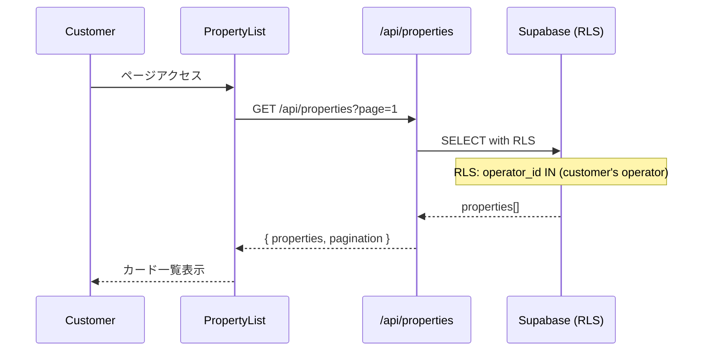

# Design Document

## Overview

**Purpose**: オペレーター向け物件管理機能とキオスクAI会話用の物件検索APIを提供。

**Users**: 物件を管理するオペレーター、システム管理者

**注意**: 顧客（キオスク利用者）は物件一覧ページにアクセスしない。物件検索はAI会話内でのみ行われる（ai-chat specを参照）。

### Goals
- 高速な物件検索
- 美しいUI/UXの物件表示
- マルチテナントでのデータ分離
- 柔軟なフィルタリング

### Non-Goals
- 物件取り込み（chrome-extension specで対応）
- 契約管理
- 決済処理

## Architecture

### System Components

```
┌─────────────────────────────────────────────────────────────────┐
│                      Browser                                    │
│  ┌───────────────────────────────────────────────────────────┐  │
│  │                   OperatorDashboard                       │  │
│  │  ┌─────────────────┐  ┌─────────────────┐  ┌────────────┐ │  │
│  │  │ PropertyTable   │  │ PropertyEditor  │  │ Filter     │ │  │
│  │  │ (物件一覧)      │  │ (物件編集)      │  │            │ │  │
│  │  └─────────────────┘  └─────────────────┘  └────────────┘ │  │
│  └──────────────────────────┬───────────────────────────────┘  │
└─────────────────────────────┼──────────────────────────────────┘
                              │
                              ▼
┌──────────────────────────────────────────────────────────────────┐
│                      Next.js API Routes                          │
│  ┌──────────────────┐  ┌──────────────────┐  ┌────────────────┐  │
│  │ GET /api/        │  │ GET /api/        │  │ PATCH /api/    │  │
│  │ properties       │  │ properties/[id]  │  │ properties/[id]│  │
│  └──────────────────┘  └──────────────────┘  └────────────────┘  │
└───────────────────────────────┬──────────────────────────────────┘
                                │
                                ▼
┌──────────────────────────────────────────────────────────────────┐
│                    Supabase (PostgreSQL + RLS)                   │
│  ┌──────────────┐  ┌──────────────────┐  ┌────────────────────┐  │
│  │ properties   │  │ property_images  │  │ customer (RLS)     │  │
│  │              │  │                  │  │                    │  │
│  └──────────────┘  └──────────────────┘  └────────────────────┘  │
└──────────────────────────────────────────────────────────────────┘
```

### Technology Stack

| Layer | Choice | Role |
|-------|--------|------|
| Frontend | React 19 + Next.js 15 | UI Components |
| Data Fetching | TanStack Query | キャッシュ・フェッチ |
| UI Components | shadcn/ui | PropertyCard, Table |
| Database | Supabase PostgreSQL | 物件データ |
| Image Storage | Supabase Storage | 物件画像 |
| Search | PostgreSQL + pgvector | 条件検索・セマンティック検索 |

## System Flows

### 物件一覧取得フロー



## Components and Interfaces

### Frontend Components

#### PropertyCard
| Field | Detail |
|-------|--------|
| Intent | 物件のサマリー表示 |
| Requirements | 1 |

**Props**
```typescript
interface PropertyCardProps {
  property: {
    id: string;
    title: string;
    address: string;
    rent: number;
    layout: string;
    images: { url: string }[];
  };
  onClick?: () => void;
}
```

#### PropertyFilter
| Field | Detail |
|-------|--------|
| Intent | 検索条件の入力 |
| Requirements | 2 |

**Props**
```typescript
interface PropertyFilterProps {
  filters: PropertyFilters;
  onFilterChange: (filters: PropertyFilters) => void;
}

interface PropertyFilters {
  area?: string;
  rent_min?: number;
  rent_max?: number;
  layout?: string;
  building_type?: string;
}
```

#### PropertyDetail
| Field | Detail |
|-------|--------|
| Intent | 物件詳細ページ |
| Requirements | 3 |

### API Routes

#### GET /api/properties

**Query Parameters**
| Param | Type | Description |
|-------|------|-------------|
| area | string | エリア |
| rent_min | number | 最低賃料 |
| rent_max | number | 最高賃料 |
| layout | string | 間取り |
| building_type | string | 建物種別 |
| page | number | ページ番号 |
| limit | number | 取得件数 |

**Response**
```json
{
  "success": true,
  "data": {
    "properties": [...],
    "pagination": {
      "total": 100,
      "page": 1,
      "limit": 20,
      "total_pages": 5
    }
  }
}
```

#### GET /api/properties/[id]

**Response**
```json
{
  "success": true,
  "data": {
    "id": "uuid",
    "title": "...",
    "address": "...",
    "rent": 150000,
    "layout": "2LDK",
    "description": "...",
    "images": [...],
    "amenities": {...}
  }
}
```

#### PATCH /api/properties/[id]

**Request**
```json
{
  "title": "更新後タイトル",
  "rent": 160000,
  "is_public": true
}
```

**Authorization**: operator or admin

## Data Models

### Property
```typescript
interface Property {
  id: string;
  operator_id: string;
  title: string;
  address: string;
  area: string;
  transaction_type: 'rent' | 'sale';
  rent?: number;
  sale_price?: number;
  layout: string;
  building_type: string;
  floor_area?: number;
  station?: string;
  distance_from_station?: number;
  description?: string;
  amenities?: Record<string, boolean>;
  is_public: boolean;
  images: PropertyImage[];
  created_at: Date;
  updated_at: Date;
}
```

### PropertyImage
```typescript
interface PropertyImage {
  id: string;
  property_id: string;
  storage_path: string;
  display_order: number;
}
```

## Security Considerations

### RLS Policies
```sql
-- オペレーター: 自社の物件のみ管理
CREATE POLICY "operator_manage_own_properties"
ON properties FOR ALL
TO authenticated
USING (
  operator_id IN (SELECT id FROM operators WHERE user_id = auth.uid())
);

-- 管理者: 全物件閲覧・管理可能
CREATE POLICY "admin_all_properties"
ON properties FOR ALL
TO authenticated
USING (
  (SELECT role FROM auth.users WHERE id = auth.uid()) = 'admin'
);
```

**キオスク用API（認証なし）**
- `/api/kiosk/chat` はService Role Keyを使用してDBアクセス
- RLSをバイパスし、operator_idでフィルタリング
- 顧客向けRLSポリシーは不要（キオスクは認証なしのため）

## Testing Strategy

### Unit Tests
- PropertyCard: 表示内容
- PropertyFilter: フィルター変更

### Integration Tests
- GET /api/properties: フィルタリング
- PATCH /api/properties/[id]: 更新

### E2E Tests
- 物件一覧 → フィルター → 詳細表示
- オペレーター: 物件編集

## Performance Considerations

### Indexes
```sql
CREATE INDEX idx_properties_operator_is_public ON properties(operator_id, is_public);
CREATE INDEX idx_properties_area ON properties(area);
CREATE INDEX idx_properties_rent ON properties(rent);
CREATE INDEX idx_properties_search ON properties(area, rent, layout) WHERE is_public = true;
```

### Image Optimization
- Next.js Image component
- WebP変換
- 遅延読み込み
