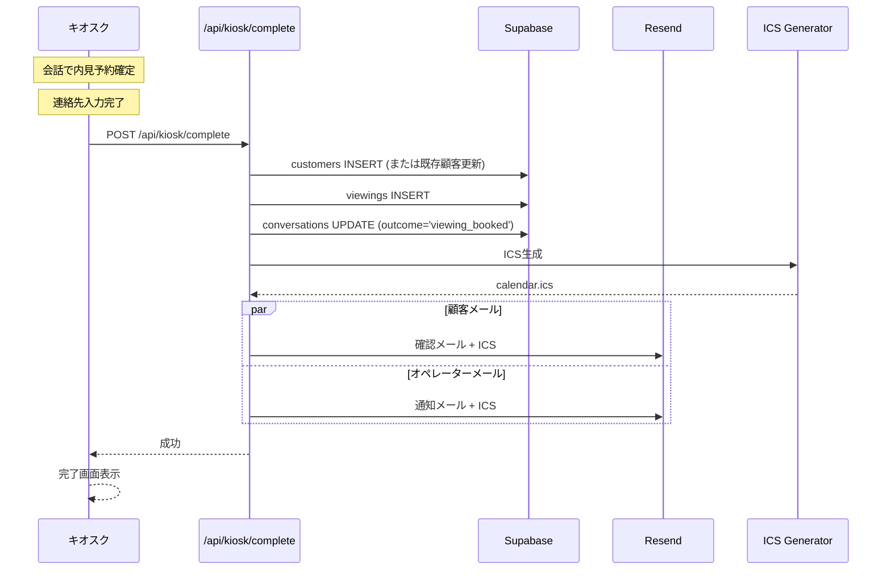
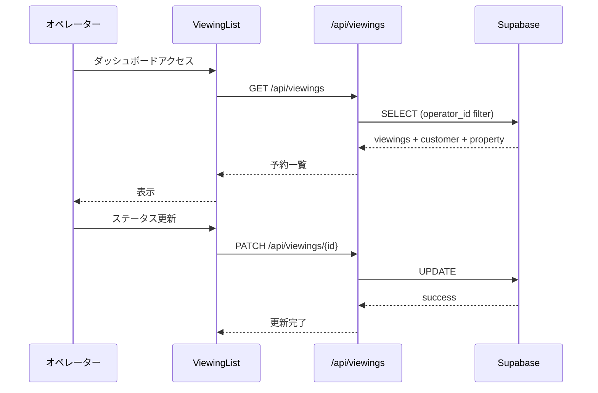

# Design Document

## Overview

**Purpose**: キオスク会話で作成された内見予約をオペレーターが管理する機能。顧客は会話を通じてのみ予約を行い、オペレーターがその後の対応を行う。

**Users**:
- キオスク利用者（予約作成は会話内で完結）
- オペレーター（予約管理）

### Goals
- キオスク会話からの予約自動作成
- 自動メール通知
- カレンダー連携
- オペレーター向け予約管理ダッシュボード

### Non-Goals
- 顧客向け予約管理画面（キオスクモデルでは不要）
- 空き状況のリアルタイム管理
- オンライン内見
- 決済機能

## Architecture

### System Components

```
┌─────────────────────────────────────────────────────────────────┐
│                    キオスク端末（店舗設置）                       │
│  ┌─────────────────────────────────────────────────────────────┐│
│  │ KioskInterface                                              ││
│  │ - AI会話で内見予約確定                                       ││
│  │ - ContactFormで連絡先入力                                    ││
│  └──────────────────────┬──────────────────────────────────────┘│
└─────────────────────────┼───────────────────────────────────────┘
                          │
                          ▼
┌──────────────────────────────────────────────────────────────────┐
│                    POST /api/kiosk/complete                      │
│  - customers INSERT                                              │
│  - viewings INSERT                                               │
│  - メール送信                                                    │
└──────────────────────────────────────────────────────────────────┘
                          │
                          ▼
┌──────────────────────────────────────────────────────────────────┐
│                    Operator Dashboard                            │
│  ┌─────────────────────────────────────────────────────────────┐ │
│  │ ViewingList (オペレーター管理画面)                          │ │
│  │ - 予約一覧                                                   │ │
│  │ - ステータス更新                                             │ │
│  │ - 担当者アサイン                                             │ │
│  │ - 会話履歴閲覧                                               │ │
│  └──────────────────────┬──────────────────────────────────────┘ │
└─────────────────────────┼────────────────────────────────────────┘
                          │
                          ▼
┌──────────────────────────────────────────────────────────────────┐
│                    Next.js API Routes                            │
│  ┌──────────────┐  ┌──────────────────┐  ┌────────────────────┐  │
│  │ GET /api/    │  │ PATCH /api/      │  │ GET /api/viewings/ │  │
│  │ viewings     │  │ viewings/[id]    │  │ [id]/conversation  │  │
│  └──────────────┘  └──────────────────┘  └────────────────────┘  │
└─────────────────────────┬────────────────────────────────────────┘
                          │
                          ▼
┌──────────────────────────────────────────────────────────────────┐
│                    Email & Calendar                              │
│  ┌──────────────────┐  ┌──────────────────────────────────────┐  │
│  │ Resend API       │  │ ICS Generator                        │  │
│  │ (React Email)    │  │ (ical-generator)                     │  │
│  └──────────────────┘  └──────────────────────────────────────┘  │
└──────────────────────────────────────────────────────────────────┘
```

### Technology Stack

| Component | Choice | Role |
|-----------|--------|------|
| Frontend | React 19 + Next.js 15 | オペレーター管理画面 |
| Email | Resend + React Email | メール送信 |
| Calendar | ical-generator | ICSファイル生成 |
| Cron | Vercel Cron | リマインダー送信 |
| Database | Supabase | 予約データ |

## System Flows

### 予約作成フロー（キオスク経由）



### オペレーター管理フロー



## Components and Interfaces

### Frontend Components

#### ViewingList（オペレーター専用）
| Field | Detail |
|-------|--------|
| Intent | 予約一覧・管理 |
| Requirements | 3 |

**Props**
```typescript
interface ViewingListProps {
  viewings: ViewingWithDetails[];
  onStatusChange: (id: string, status: ViewingStatus) => void;
  onAssign: (id: string, userId: string) => void;
}

interface ViewingWithDetails {
  id: string;
  viewing_date: Date;
  status: ViewingStatus;
  customer: {
    name: string;
    phone: string;
    email: string;
  };
  property: {
    title: string;
    address: string;
  };
  assigned_to?: string;
  conversation_id?: string;
}
```

#### ViewingDetail（オペレーター専用）
| Field | Detail |
|-------|--------|
| Intent | 予約詳細・会話履歴閲覧 |
| Requirements | 3 |

**Props**
```typescript
interface ViewingDetailProps {
  viewing: ViewingWithDetails;
  conversation?: Conversation;
  onStatusChange: (status: ViewingStatus) => void;
  onCancel: (reason: string) => void;
}
```

#### ViewingFilter
| Field | Detail |
|-------|--------|
| Intent | 予約フィルタリング |
| Requirements | 3 |

**Props**
```typescript
interface ViewingFilterProps {
  onFilterChange: (filters: ViewingFilters) => void;
}

interface ViewingFilters {
  status?: ViewingStatus;
  from_date?: Date;
  to_date?: Date;
  assigned_to?: string;
}
```

### API Routes

#### GET /api/viewings（オペレーター認証必須）

**Query Parameters**
| Param | Type | Description |
|-------|------|-------------|
| status | string | ステータスフィルター |
| from_date | string | 開始日 |
| to_date | string | 終了日 |
| assigned_to | string | 担当者フィルター |

**Response**
```json
{
  "success": true,
  "data": {
    "viewings": [
      {
        "id": "uuid",
        "viewing_date": "2025-01-20T14:00:00+09:00",
        "status": "confirmed",
        "customer": {
          "name": "山田太郎",
          "phone": "090-1234-5678",
          "email": "yamada@example.com"
        },
        "property": {
          "id": "uuid",
          "title": "文京区マンション",
          "address": "東京都文京区..."
        },
        "assigned_to": null,
        "conversation_id": "uuid"
      }
    ],
    "pagination": {
      "total": 25,
      "page": 1,
      "limit": 20
    }
  }
}
```

#### PATCH /api/viewings/[id]（オペレーター認証必須）

**Request**
```json
{
  "status": "completed",
  "assigned_to": "user-uuid",
  "notes": "内見完了。気に入っていただけた様子"
}
```

#### DELETE /api/viewings/[id]（キャンセル）

**Request**
```json
{
  "cancellation_reason": "お客様都合によるキャンセル"
}
```

**Response**
```json
{
  "success": true,
  "data": {
    "message": "予約をキャンセルしました",
    "email_sent": true
  }
}
```

#### GET /api/viewings/[id]/conversation

**Response**
```json
{
  "success": true,
  "data": {
    "conversation": {
      "id": "uuid",
      "messages": [
        {
          "role": "assistant",
          "content": "いらっしゃいませ。",
          "timestamp": "..."
        },
        {
          "role": "user",
          "content": "2LDKを探しています",
          "timestamp": "..."
        }
      ],
      "started_at": "...",
      "ended_at": "..."
    }
  }
}
```

### Email Templates

#### ViewingConfirmationEmail（顧客向け）
```typescript
interface ViewingConfirmationEmailProps {
  customerName: string;
  propertyTitle: string;
  propertyAddress: string;
  viewingDate: string;
  viewingTime: string;
  operatorName: string;
  operatorPhone: string;
}
```

#### ViewingNotificationEmail（オペレーター向け）
```typescript
interface ViewingNotificationEmailProps {
  customerName: string;
  customerPhone: string;
  customerEmail: string;
  propertyTitle: string;
  viewingDate: string;
  conversationSummary?: string;
}
```

#### ViewingReminderEmail
```typescript
interface ViewingReminderEmailProps {
  customerName: string;
  propertyTitle: string;
  propertyAddress: string;
  viewingDate: string;
  viewingTime: string;
  operatorName: string;
  operatorPhone: string;
}
```

#### ViewingCancellationEmail
```typescript
interface ViewingCancellationEmailProps {
  customerName: string;
  propertyTitle: string;
  viewingDate: string;
  cancellationReason: string;
  operatorPhone: string;
}
```

### ICS Generator
```typescript
interface ViewingEvent {
  title: string;
  description: string;
  start: Date;
  end: Date;
  location: string;
  organizer?: {
    name: string;
    email: string;
  };
}

function generateICS(event: ViewingEvent): string;
```

## Data Models

### Viewing
```typescript
interface Viewing {
  id: string;
  customer_id: string;
  property_id: string;
  operator_id: string;
  conversation_id?: string;  // キオスク会話との紐付け
  viewing_date: Date;
  duration_minutes: number;
  status: 'confirmed' | 'completed' | 'cancelled' | 'no_show';
  assigned_to?: string;
  notes?: string;
  cancelled_at?: Date;
  cancellation_reason?: string;
  reminder_sent: boolean;
  created_at: Date;
  updated_at: Date;
}
```

### Customer（キオスクで収集）
```typescript
interface Customer {
  id: string;
  operator_id: string;
  name: string;
  phone: string;
  email: string;
  source: 'kiosk' | 'web' | 'manual';  // キオスクの場合は'kiosk'
  created_at: Date;
  updated_at: Date;
}
```

## Error Handling

### API Errors
- 403 Forbidden: 他社の予約にアクセス
- 404 Not Found: 予約が存在しない
- 409 Conflict: すでにキャンセル済み

### Email Errors
- 送信失敗 → リトライキューに追加
- バウンス → 配信停止リストに追加

## Testing Strategy

### Unit Tests
- ICS Generator: フォーマット
- ViewingService: CRUD操作

### Integration Tests
- キオスク完了 → 予約作成 → メール送信
- ステータス更新

### E2E Tests
- オペレーター: 一覧表示 → 詳細 → ステータス更新
- キャンセルフロー

## Security Considerations

- RLS: オペレーターは自社の予約のみ閲覧・更新可能
- 認証: オペレーター向けAPIは認証必須
- キオスクAPI: operator_idでデータ分離
