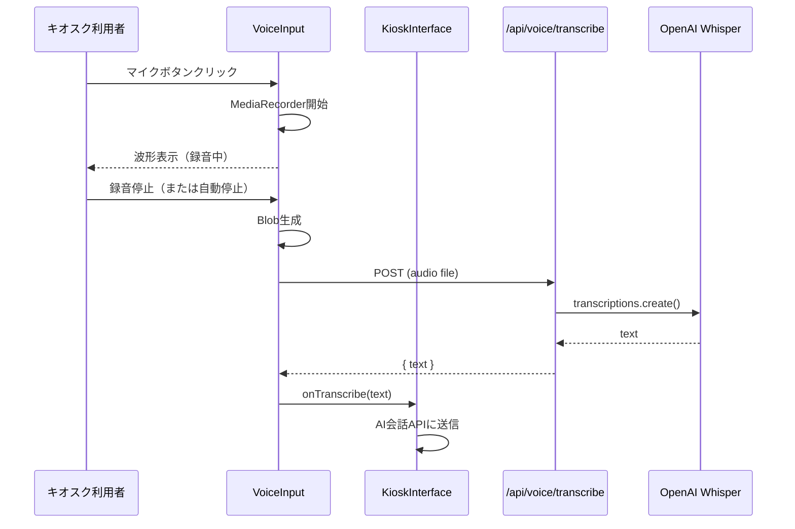
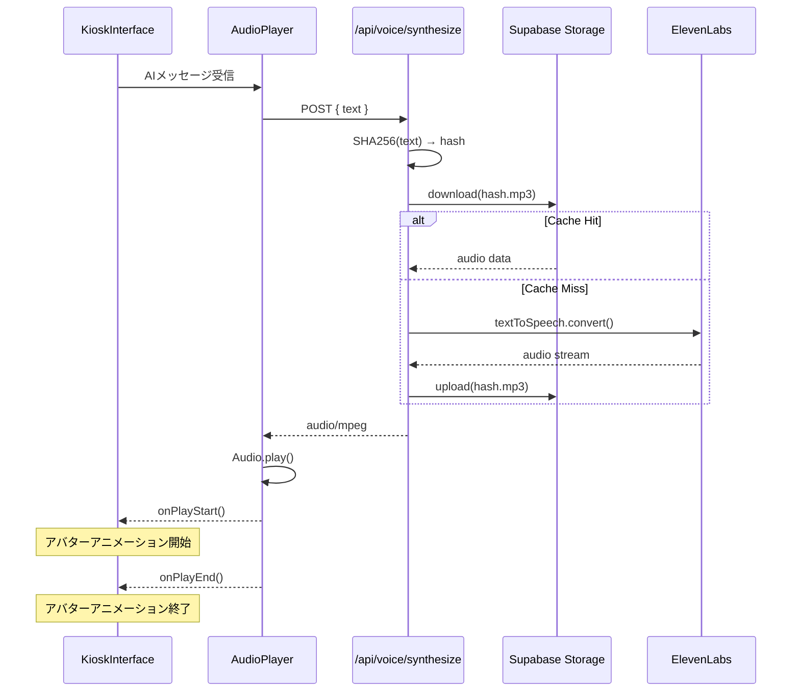

# Design Document

## Overview

**Purpose**: キオスク端末での音声会話インターフェースを提供し、タイピングが苦手な顧客（特に高齢者）でも快適に物件を探せるようにする。

**Users**: キオスク端末を利用する店舗来店客（認証不要）

### Goals
- 自然な日本語音声認識
- 高品質な音声合成
- 低レイテンシーの応答
- コスト効率の良いキャッシング
- **高齢者にも使いやすいUI**: 音声入力ボタンを画面中央に大きく配置

### Non-Goals
- 多言語対応（日本語のみ）
- リアルタイム字幕生成
- 音声ファイルのアップロード
- オペレーター管理画面での音声機能（テキストベースのみ）

## Architecture

### System Components

```
┌─────────────────────────────────────────────────────────────────┐
│                    キオスク端末（店舗設置）                       │
│  ┌───────────────────────────────────────────────────────────┐  │
│  │                    VoiceInterface                         │  │
│  │  ┌─────────────┐  ┌─────────────┐  ┌─────────────────┐   │  │
│  │  │ VoiceInput  │  │ AudioPlayer │  │ VoiceWaveform   │   │  │
│  │  │ (Record)    │  │ (Playback)  │  │ (Visualization) │   │  │
│  │  └──────┬──────┘  └──────┬──────┘  └─────────────────┘   │  │
│  └─────────┼────────────────┼───────────────────────────────┘  │
└────────────┼────────────────┼──────────────────────────────────┘
             │                │
             ▼                ▼
┌────────────────────┐  ┌────────────────────┐
│ POST /api/voice/   │  │ POST /api/voice/   │
│ transcribe         │  │ synthesize         │
│                    │  │                    │
│ OpenAI Whisper API │  │ ElevenLabs API     │
└────────────────────┘  │ + Supabase Cache   │
                        └────────────────────┘
```

### Technology Stack

| Layer | Choice / Version | Role |
|-------|------------------|------|
| Audio Recording | Web Audio API, MediaRecorder | ブラウザ音声録音 |
| STT | OpenAI Whisper API | 音声→テキスト |
| TTS | ElevenLabs API | テキスト→音声 |
| Cache | Supabase Storage | 音声キャッシュ |
| Audio Playback | HTML5 Audio API | 音声再生 |

## System Flows

### 音声入力フロー（キオスクUI統合）



### 音声出力フロー（自動再生）



## Components and Interfaces

### Frontend Components

#### VoiceInput（キオスク専用）
| Field | Detail |
|-------|--------|
| Intent | 音声録音とテキスト変換 |
| Requirements | 1 |

**UI設計（高齢者対応）**
```
┌─────────────────────────────────────────────────────────┐
│                                                         │
│                                                         │
│              ┌─────────────────────┐                   │
│              │                     │                   │
│              │    🎤               │                   │
│              │                     │                   │
│              │   タップして        │                   │
│              │   お話しください     │                   │
│              │                     │                   │
│              └─────────────────────┘                   │
│                  (120px × 120px)                       │
│                                                         │
│  ┌─────────────────────────────────────────────────┐   │
│  │ [___テキスト入力___]              [送信]        │   │
│  └─────────────────────────────────────────────────┘   │
└─────────────────────────────────────────────────────────┘
```

**設計ポイント**
- 音声ボタンは画面中央に大きく配置（120px × 120px以上）
- ボタンには「タップしてお話しください」のラベルを表示
- 録音中は波形アニメーションとカウントダウン表示
- テキスト入力は補助的な位置（下部に小さく配置）

**State**
```typescript
interface VoiceInputState {
  isRecording: boolean;
  audioBlob: Blob | null;
  isProcessing: boolean;
  recordingDuration: number;
}
```

**Props**
```typescript
interface VoiceInputProps {
  onTranscribe: (text: string) => void;
  disabled?: boolean;
  maxDuration?: number; // デフォルト60秒
  size?: 'large' | 'medium'; // デフォルト'large'（キオスク用）
}
```

#### AudioPlayer（キオスク専用）
| Field | Detail |
|-------|--------|
| Intent | 音声再生とアバター連携 |
| Requirements | 2, 4 |

**Props**
```typescript
interface AudioPlayerProps {
  text: string;
  autoPlay: boolean; // キオスクでは常にtrue
  onPlayStart?: () => void;
  onPlayEnd?: () => void;
  onInterrupt?: () => void; // ユーザーが話し始めた時
}
```

#### VoiceWaveform
| Field | Detail |
|-------|--------|
| Intent | 録音中の波形表示 |
| Requirements | 1 |

**Props**
```typescript
interface VoiceWaveformProps {
  analyser: AnalyserNode | null;
  isRecording: boolean;
}
```

### API Routes

#### POST /api/voice/transcribe

認証なしでアクセス可能（キオスク用）

**Request**: multipart/form-data
```
audio: File (webm/mp3)
operator_id: string (レート制限用)
```

**Response**
```json
{
  "success": true,
  "data": {
    "text": "文京区で2LDKの物件を探しています",
    "duration": 3.5,
    "language": "ja"
  }
}
```

#### POST /api/voice/synthesize

認証なしでアクセス可能（キオスク用）

**Request**
```json
{
  "text": "かしこまりました。文京区で2LDKの物件ですね。",
  "operator_id": "uuid"
}
```

**Response**: audio/mpeg (binary)

**Headers**
```
X-Cache-Status: HIT | MISS
Content-Type: audio/mpeg
```

## Data Models

### Audio Cache Key
```
audio-cache/{operator_id}/{sha256_hash}.mp3
```

### Supabase Storage Bucket
- Bucket: `audio-cache`
- Public: No
- Max file size: 5MB
- Allowed types: audio/mpeg
- Lifecycle: 30日後自動削除

### Pre-cached Phrases（事前キャッシュ）
```typescript
const PRECACHED_PHRASES = [
  "いらっしゃいませ。何かお探しでしょうか？",
  "かしこまりました。",
  "少々お待ちください。",
  "ありがとうございます。",
  "またのご来店をお待ちしております。",
];
```

## Error Handling

### Transcription Errors
- マイク許可拒否 → テキスト入力にフォールバック、許可を促すメッセージ
- 録音失敗 → 再試行ボタン表示
- Whisper APIエラー → テキスト入力を促す
- 無音検出 → 「お話が聞き取れませんでした」メッセージ

### Synthesis Errors
- ElevenLabs APIエラー → テキストのみ表示（音声なし）
- キャッシュ保存失敗 → ログ出力（サイレント失敗）
- 音声再生失敗 → 再生ボタン表示

## Testing Strategy

### Unit Tests
- VoiceInput: 録音状態管理
- AudioPlayer: 再生コントロール
- キャッシュキー生成

### Integration Tests
- /api/voice/transcribe: Whisper API呼び出し
- /api/voice/synthesize: ElevenLabs + キャッシュ

### E2E Tests
- 録音→変換→AI送信
- AI応答→音声生成→自動再生

## Performance Considerations

- 音声ファイルサイズ: 最大5MB
- キャッシュヒット率の監視
- ElevenLabs レート制限: operator_idごとにレート制限
- 録音最大時間: 60秒
- 事前キャッシュ: よく使うフレーズを起動時にキャッシュ
