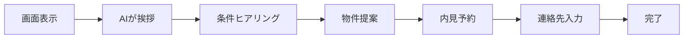
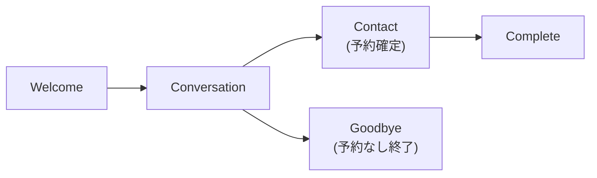

# 要件定義書

**案件名:** 不動産AIエージェントシステム（madoguchi-ai）
**発行日:** 2025年12月7日
**バージョン:** 1.0
**作成者:** 小松原遼羽

---

## 1. システム概要

### 1.1 目的

不動産店舗に設置するAI接客キオスクシステムを開発します。AIアバターが24時間365日お客様対応を行い、物件検索から内見予約までをワンストップで実現します。

### 1.2 解決する課題

| 現状の課題 | 本システムによる解決 |
|-----------|-------------------|
| 営業時間外は顧客対応ができない | AIが24時間対応 |
| 営業担当者が接客中は他の顧客を待たせる | キオスク端末で即時対応 |
| 高齢者はWebサイト操作が困難 | 音声会話で直感的に操作 |
| 物件登録作業に時間がかかる | Chrome拡張でワンクリック取り込み |

### 1.3 対象ユーザー

| ユーザー種別 | 説明 | 主な利用シーン |
|------------|------|--------------|
| **来店客** | 不動産店舗を訪れるお客様 | キオスク端末でAIと会話して物件を探す |
| **オペレーター** | 不動産会社の担当者 | 物件登録、顧客管理、予約管理 |
| **システム管理者** | サービス提供者（gyam様） | オペレーター企業の管理 |

---

## 2. 機能要件

### 2.1 AI会話システム

来店客がAIアバターと会話して物件を探し、内見予約まで完了できる機能です。

**できること:**
- AIアバターとの自然な会話
- 音声での入力・読み上げ対応（高齢者向け）
- 会話を通じた希望条件のヒアリング
- 条件に合った物件の提案・説明
- 会話の中で内見予約
- 予約完了後の連絡先入力
- アバターの感情表現（5種類）

**操作の流れ:**

### 2.2 音声入出力システム

高齢者でも使いやすい音声インターフェースを提供します。

**できること:**
- マイクボタンで音声入力（最大60秒）
- AIの返答を音声で読み上げ
- 自然な日本語音声
- 再生/一時停止コントロール

### 2.3 Chrome拡張機能

不動産ポータルサイトから物件情報を簡単に取り込めます。

**できること:**
- アットホーム等の物件ページを自動検出
- ワンクリックで物件情報を取り込み
- AIが自動で情報を整理・構造化
- 取り込み元のHTMLを証拠として保存

**対応サイト（予定）:**
- アットホーム
- SUUMO
- その他（順次追加）

### 2.4 物件管理機能

オペレーターが自社の物件を管理できます。

**できること:**
- 物件一覧の表示・検索・フィルター
- 物件情報の編集・公開/非公開切り替え
- 手動での物件登録
- 物件削除

### 2.5 内見予約管理機能

キオスクで作成された予約をオペレーターが管理できます。

**できること:**
- 予約一覧の確認
- ステータス更新（確定、完了、キャンセル、ノーショー）
- 担当者のアサイン
- 予約確認メール・リマインダーメールの自動送信
- カレンダー招待（.icsファイル）の添付

### 2.6 営業メール配信機能

新着物件を既存顧客に配信できます。

**できること:**
- 条件に合う顧客への一括メール配信
- 重複送信の防止（直近7日以内に送信済みの顧客を除外）
- 配信失敗時の自動リトライ（最大3回）
- 配信停止管理（バウンス・苦情の自動処理）
- 配信統計の確認

### 2.7 オペレーター管理機能

システム管理者がオペレーター企業を管理できます。

**できること:**
- オペレーター企業の登録・編集・削除
- サブスクリプション管理
- システム全体の統計確認
- オペレーター別の利用状況確認

---

## 3. 非機能要件

### 3.1 パフォーマンス

| 項目 | 要件 |
|------|------|
| 応答時間 | AIの返答は5秒以内 |
| 同時接続 | オペレーターあたり10端末同時利用可能 |
| 可用性 | 99.9%（年間ダウンタイム8.76時間以内） |

### 3.2 セキュリティ

| 項目 | 対策 |
|------|------|
| データ分離 | オペレーターごとにデータを完全分離（RLS） |
| 通信暗号化 | HTTPS（TLS 1.3） |
| 認証 | Supabase Auth（メール/パスワード） |
| 個人情報 | 顧客の連絡先情報は暗号化保存 |
| 顧客情報アクセス制限 | システム管理者（ギヤマン様）は各オペレーターの顧客情報を閲覧不可 |

### 3.3 運用・保守

| 項目 | 内容 |
|------|------|
| バックアップ | 日次自動バックアップ |
| 監視 | エラー発生時の自動通知 |
| ログ | 操作ログを90日間保持 |

---

## 4. 画面構成

### 4.1 画面一覧（全26画面）

| カテゴリ | 画面数 | 内容 |
|---------|--------|------|
| 共通 | 3 | ランディングページ、ログイン、エラー |
| キオスク（顧客向け） | 1 | AI接客画面（5つのフェーズを遷移） |
| オペレーター管理 | 12 | ダッシュボード、物件・顧客・予約・会話・マーケティング管理 |
| システム管理者 | 10 | オペレーター・サブスクリプション・統計・監査ログ管理 |

### 4.2 キオスク画面のフェーズ

---

## 5. 用語集

| 用語 | 説明 |
|------|------|
| キオスク | 店舗に設置するタブレット/PC端末 |
| オペレーター | 本システムを利用する不動産会社 |
| 来店客 | 不動産店舗を訪れるお客様（ログイン不要） |
| 内見 | 物件を実際に見学すること |
| セマンティック検索 | AIを使った意味ベースの検索 |

---

## 6. 前提条件・制約

### 6.1 前提条件

- インターネット接続が常時利用可能
- キオスク端末にマイク・スピーカーが搭載されている
- Chrome拡張機能はGoogle Chromeブラウザで使用

### 6.2 制約

- 対応言語は日本語のみ
- 対応ブラウザはChrome/Edge（最新版）
- 外部サービス（OpenAI、ElevenLabs等）の利用規約に準拠

---

## 7. 承認

本要件定義書の内容について確認・承認いたします。

| 項目 | 内容 |
|------|------|
| 発注者 | 株式会社ギヤマン |
| 署名 | __________________ |
| 日付 | ____年____月____日 |

| 項目 | 内容 |
|------|------|
| 受注者 | 小松原遼羽 |
| 署名 | __________________ |
| 日付 | ____年____月____日 |
