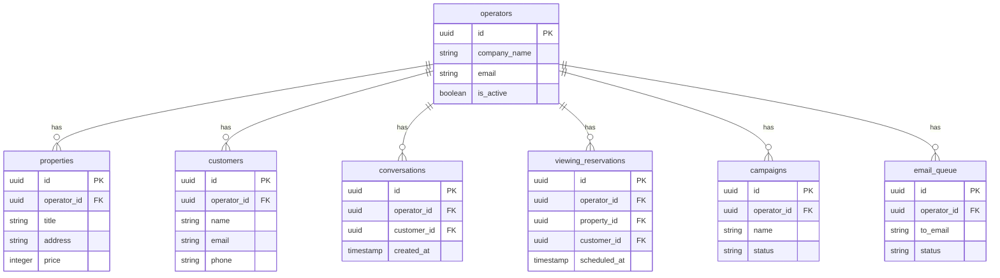

# システム設計書（概要版）

**案件名:** 不動産AIエージェントシステム（madoguchi-ai）
**発行日:** 2025年12月7日
**バージョン:** 1.0
**作成者:** 小松原遼羽

---

## 1. システム構成

### 1.1 全体アーキテクチャ


### 1.2 デプロイ構成

| コンポーネント | サービス | 説明 |
|--------------|---------|------|
| Webアプリケーション | Vercel | Next.jsアプリのホスティング |
| データベース | Supabase | PostgreSQL + pgvector |
| 認証 | Supabase Auth | メール/パスワード認証 |
| ファイル保存 | Supabase Storage | 画像、音声キャッシュ、HTMLスナップショット |
| AI会話 | OpenAI | GPT-4o、Whisper |
| 音声合成 | ElevenLabs | 日本語音声生成 |
| メール配信 | Resend | トランザクションメール |
| 定期実行 | Vercel Cron | リマインダー、キュー処理 |

---

## 2. 技術スタック

### 2.1 フロントエンド

| 技術 | バージョン | 用途 |
|------|-----------|------|
| Next.js | 15 | Reactフレームワーク（App Router） |
| React | 19 | UIライブラリ |
| TypeScript | 5.x | 型安全な開発 |
| Tailwind CSS | 4 | スタイリング |
| shadcn/ui | - | UIコンポーネント |
| Framer Motion | - | アバターアニメーション |
| Zustand | - | 状態管理 |
| TanStack Query | - | サーバーステート管理 |

### 2.2 バックエンド

| 技術 | 用途 |
|------|------|
| Next.js API Routes | REST API |
| Supabase Client | データベースアクセス |
| Vercel AI SDK | AI機能統合 |
| OpenAI SDK | GPT-4o / Whisper連携 |
| Resend | メール送信 |
| React Email | メールテンプレート |

### 2.3 データベース

| 技術 | 用途 |
|------|------|
| PostgreSQL | リレーショナルDB |
| pgvector | セマンティック検索（物件検索） |
| Row Level Security | マルチテナントデータ分離 |

---

## 3. データベース設計

### 3.1 主要テーブル



### 3.2 テーブル一覧

| テーブル名 | 説明 |
|-----------|------|
| operators | オペレーター（不動産会社） |
| properties | 物件情報 |
| property_imports | 物件取り込み履歴 |
| customers | 顧客情報 |
| conversations | 会話履歴 |
| messages | 会話メッセージ |
| viewing_reservations | 内見予約 |
| campaigns | メールキャンペーン |
| email_queue | メール送信キュー |
| email_suppressions | 配信停止リスト |
| audio_cache | 音声キャッシュ |

### 3.3 データ分離

Row Level Security (RLS) により、オペレーターごとにデータを完全分離します。

```sql
-- 例: オペレーターは自社の物件のみ閲覧可能
CREATE POLICY "operators_own_properties" ON properties
  FOR ALL
  USING (operator_id = auth.uid());
```

---

## 4. API設計

### 4.1 API一覧

| エンドポイント | メソッド | 説明 |
|---------------|---------|------|
| `/api/chat` | POST | AI会話メッセージ送信 |
| `/api/speech/recognize` | POST | 音声認識（Whisper） |
| `/api/speech/synthesize` | POST | 音声合成（ElevenLabs） |
| `/api/properties` | GET/POST | 物件一覧/登録 |
| `/api/properties/[id]` | GET/PUT/DELETE | 物件詳細/更新/削除 |
| `/api/properties/search` | POST | セマンティック検索 |
| `/api/properties/import` | POST | Chrome拡張からの取り込み |
| `/api/viewings` | GET/POST | 内見予約一覧/作成 |
| `/api/viewings/[id]` | GET/PUT | 予約詳細/更新 |
| `/api/campaigns` | GET/POST | キャンペーン一覧/作成 |
| `/api/campaigns/[id]/send` | POST | キャンペーン配信 |
| `/api/webhooks/resend` | POST | Resend Webhook受信 |

### 4.2 認証

- **キオスク**: 認証不要（operator_idをURLパラメータで指定）
- **オペレーター/管理者**: Supabase Auth JWT

---

## 5. セキュリティ設計

### 5.1 認証・認可

| 対象 | 方式 |
|------|------|
| オペレーター | メール/パスワード認証 |
| システム管理者 | メール/パスワード認証 + ロール確認 |
| キオスク利用者 | 認証不要 |

### 5.2 データ保護

| 対策 | 説明 |
|------|------|
| 通信暗号化 | HTTPS (TLS 1.3) |
| データ分離 | RLSによるマルチテナント分離 |
| 個人情報 | 顧客連絡先は暗号化保存 |
| APIキー | 環境変数で管理、コードに含めない |

### 5.3 入力検証

| 対象 | 検証内容 |
|------|---------|
| メールアドレス | 形式チェック |
| 電話番号 | 形式チェック |
| HTML | XSSサニタイズ |
| SQLインジェクション | Supabase Clientで自動対策 |

---

## 6. 外部サービス連携

### 6.1 OpenAI

| API | 用途 | 料金目安 |
|-----|------|---------|
| GPT-4o | AI会話、物件情報構造化 | $2.50/100万トークン |
| Whisper | 音声認識 | $0.006/分 |
| Embeddings | セマンティック検索 | $0.02/100万トークン |

### 6.2 ElevenLabs

| 用途 | 料金目安 |
|------|---------|
| 音声合成（日本語） | $0.30/1000文字 |

### 6.3 Resend

| 用途 | 料金目安 |
|------|---------|
| メール送信 | $0.001/通 |
| Webhook | 無料 |

---

## 7. 運用設計

### 7.1 監視

| 対象 | ツール |
|------|-------|
| アプリケーション | Vercel Analytics |
| エラー | Vercel Logs |
| データベース | Supabase Dashboard |

### 7.2 バックアップ

| 対象 | 頻度 | 保持期間 |
|------|------|---------|
| データベース | 日次 | 30日 |
| ファイルストレージ | 日次 | 30日 |

### 7.3 定期ジョブ

| ジョブ | 頻度 | 説明 |
|-------|------|------|
| 内見リマインダー | 毎日9:00 | 翌日の内見予約にリマインダー送信 |
| メールキュー処理 | 毎分 | 失敗メールのリトライ |
| 音声キャッシュ削除 | 毎日深夜 | 30日以上古いキャッシュを削除 |

---

## 8. 承認

本システム設計書の内容について確認・承認いたします。

| 項目 | 内容 |
|------|------|
| 発注者 | 株式会社ギヤマン |
| 署名 | __________________ |
| 日付 | ____年____月____日 |

| 項目 | 内容 |
|------|------|
| 受注者 | 小松原遼羽 |
| 署名 | __________________ |
| 日付 | ____年____月____日 |
