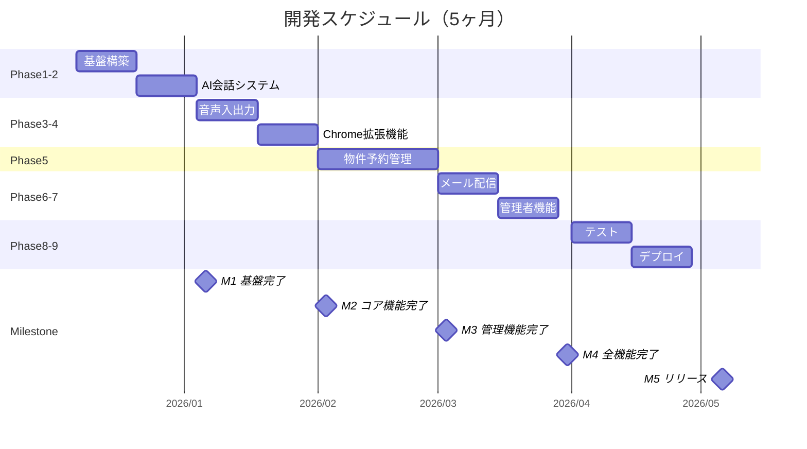

# 開発スケジュール

**案件名:** 不動産AIエージェントシステム（madoguchi-ai）
**発行日:** 2025年12月7日
**バージョン:** 1.0
**作成者:** 小松原遼羽

---

## 1. プロジェクト概要

| 項目 | 内容 |
|------|------|
| 開発期間 | 5ヶ月 |
| 開始予定 | 契約締結後 |
| 完了予定 | 開始から5ヶ月後 |
| 総工数 | 約1,230時間 |

---

## 2. フェーズ別スケジュール

### 全体タイムライン

---

## 3. 各フェーズの詳細

### Phase 1: 基盤構築・インフラ（1ヶ月目前半）

| タスク | 工数 | 内容 |
|--------|------|------|
| プロジェクトセットアップ | 15h | Next.js 15、TypeScript、pnpm |
| データベース設計・実装 | 40h | PostgreSQL + pgvector |
| マルチテナント構造・RLS | 30h | Row Level Security設定 |
| 認証基盤 | 20h | Supabase Auth設定 |
| **小計** | **105h** | |

**成果物:**
- 動作する開発環境
- データベーススキーマ
- 認証機能

---

### Phase 2: AI会話システム（1ヶ月目後半）

| タスク | 工数 | 内容 |
|--------|------|------|
| キオスクセッション管理 | 15h | Zustand状態管理 |
| GPT-4o統合 | 40h | Function Calling実装 |
| AI System Prompt設計 | 20h | 会話シナリオ設計 |
| 会話UI | 35h | メッセージ、物件カード表示 |
| 連絡先入力・予約完了フロー | 25h | フォーム実装 |
| アバター感情表現 | 30h | 5種類のアニメーション |
| **小計** | **165h** | |

**成果物:**
- キオスク画面（動作版）
- AI会話機能
- 内見予約フロー

---

### Phase 3: 音声入出力（2ヶ月目前半）

| タスク | 工数 | 内容 |
|--------|------|------|
| 音声入力 | 30h | Whisper API統合 |
| 音声出力 | 30h | ElevenLabs API統合 |
| 音声キャッシング | 20h | Supabase Storage連携 |
| 音声コントロールUI | 20h | 再生/停止、音量調整 |
| **小計** | **100h** | |

**成果物:**
- 音声入力機能
- 音声読み上げ機能
- 音声キャッシュシステム

---

### Phase 4: Chrome拡張機能（2ヶ月目後半）

| タスク | 工数 | 内容 |
|--------|------|------|
| 拡張機能プロジェクト構成 | 15h | Manifest V3設定 |
| Content Script | 20h | 物件ページ検出 |
| Background Service Worker | 25h | API通信処理 |
| Popup UI | 20h | React実装 |
| GPT-4o構造化抽出 | 30h | 物件情報抽出ロジック |
| HTMLスナップショット保存 | 15h | 証跡保存 |
| **小計** | **125h** | |

**成果物:**
- Chrome拡張機能（アットホーム対応）
- 物件自動取り込み機能

---

### Phase 5: 物件・内見予約管理（3ヶ月目）

| タスク | 工数 | 内容 |
|--------|------|------|
| PropertyService実装 | 25h | ビジネスロジック |
| 物件API | 30h | CRUD操作 |
| 物件管理UI | 40h | 一覧・詳細・編集画面 |
| ViewingService実装 | 25h | ビジネスロジック |
| 内見予約API | 30h | 予約処理 |
| ICS生成・カレンダー招待 | 15h | .icsファイル生成 |
| 内見管理UI | 35h | 予約一覧・詳細画面 |
| リマインダーCronジョブ | 10h | 自動リマインダー |
| **小計** | **210h** | |

**成果物:**
- 物件管理画面
- 内見予約管理画面
- カレンダー招待機能

---

### Phase 6: 営業メール・マーケティング（4ヶ月目前半）

| タスク | 工数 | 内容 |
|--------|------|------|
| データベースマイグレーション | 20h | 4テーブル追加 |
| 配信停止管理サービス | 25h | バウンス処理 |
| メールキューサービス | 30h | リトライ機能 |
| キャンペーンサービス | 30h | 一括配信 |
| Resend Webhook連携 | 20h | イベント受信 |
| キャンペーンAPI・UI | 35h | 管理画面 |
| キューワーカー | 15h | Vercel Cron |
| **小計** | **175h** | |

**成果物:**
- キャンペーン管理画面
- メール配信機能
- 配信停止管理

---

### Phase 7: オペレーター・管理者機能（4ヶ月目後半）

| タスク | 工数 | 内容 |
|--------|------|------|
| OperatorService実装 | 25h | ビジネスロジック |
| StatsService実装 | 20h | 統計計算 |
| 管理者API | 30h | オペレーター管理 |
| 管理者ダッシュボード | 35h | 統計表示 |
| オペレーター管理UI | 30h | 登録・編集画面 |
| **小計** | **140h** | |

**成果物:**
- 管理者ダッシュボード
- オペレーター管理画面
- システム統計機能

---

### Phase 8: テスト・品質保証（5ヶ月目前半）

| タスク | 工数 | 内容 |
|--------|------|------|
| 単体テスト | 40h | Vitest |
| 統合テスト | 35h | API・サービス間連携 |
| E2Eテスト | 30h | Playwright |
| 品質保証・バグ修正 | 25h | 最終調整 |
| **小計** | **130h** | |

**成果物:**
- テストコード一式
- バグ修正完了

---

### Phase 9: デプロイ・ドキュメント（5ヶ月目後半）

| タスク | 工数 | 内容 |
|--------|------|------|
| Vercelデプロイ設定 | 20h | 本番環境構築 |
| Supabase本番環境設定 | 15h | 本番DB設定 |
| セキュリティ対策・監査 | 25h | 脆弱性チェック |
| 操作マニュアル作成 | 20h | ユーザー向けドキュメント |
| **小計** | **80h** | |

**成果物:**
- 本番環境
- 操作マニュアル
- 引き継ぎ資料

---

## 4. マイルストーン

| マイルストーン | 時期 | 確認事項 |
|--------------|------|---------|
| **M1: 基盤完了** | 1ヶ月目終了 | 開発環境、認証、キオスク基本動作 |
| **M2: コア機能完了** | 2ヶ月目終了 | 音声対応、Chrome拡張動作 |
| **M3: 管理機能完了** | 3ヶ月目終了 | 物件・予約管理画面 |
| **M4: 全機能完了** | 4ヶ月目終了 | メール配信、管理者機能 |
| **M5: リリース** | 5ヶ月目終了 | テスト完了、本番デプロイ |

---

## 5. 進捗報告

| 報告種類 | 頻度 | 内容 |
|---------|------|------|
| 週次報告 | 毎週 | 進捗状況、課題、次週予定 |
| マイルストーン報告 | 各M時 | 成果物確認、デモ |
| 月次報告 | 毎月 | 工数実績、予算消化状況 |

---

## 6. リスクと対策

| リスク | 影響 | 対策 |
|--------|------|------|
| 外部API仕様変更 | 機能不具合 | 最新ドキュメント確認、早期テスト |
| 想定外の技術課題 | スケジュール遅延 | バッファ時間を確保（15%） |
| 要件変更 | 工数増加 | 変更管理プロセスを設定 |

---

## 7. 承認

本開発スケジュールの内容について確認・承認いたします。

| 項目 | 内容 |
|------|------|
| 甲 | 株式会社ギヤマン |
| 記名捺印 | __________________ |
| 日付 | ____年____月____日 |

| 項目 | 内容 |
|------|------|
| 乙 | 小松原遼羽 |
| 署名捺印 | __________________ |
| 日付 | ____年____月____日 |
