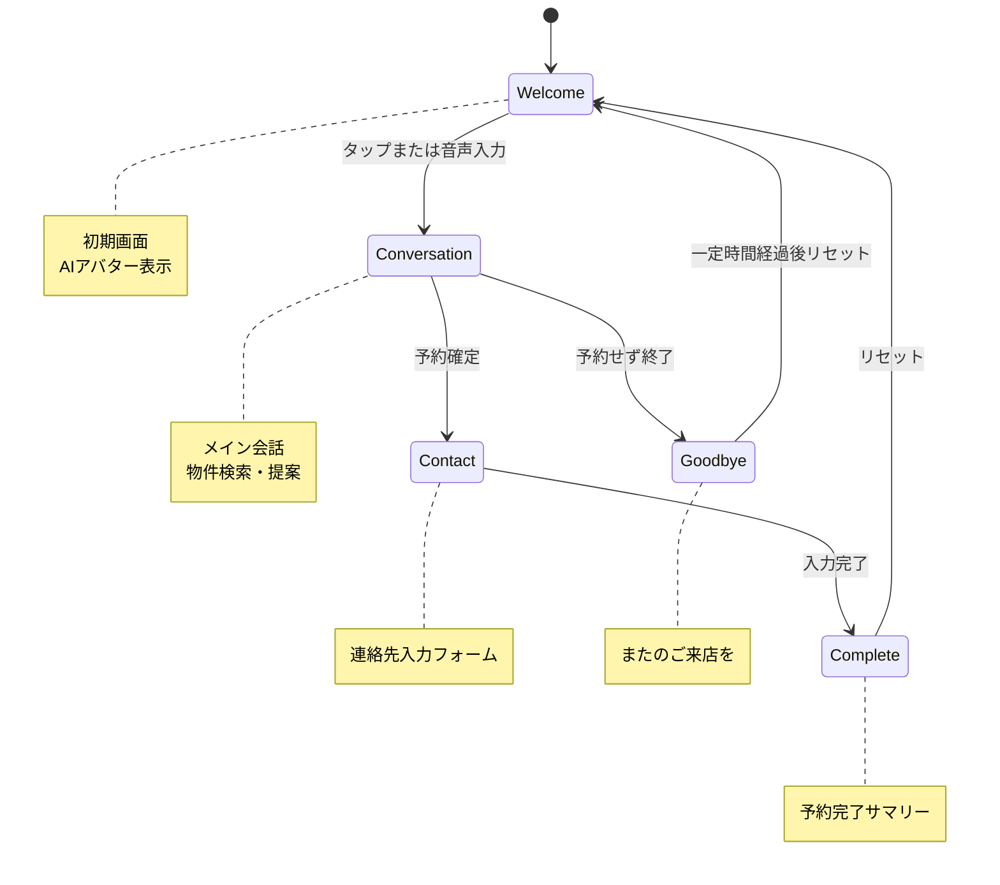
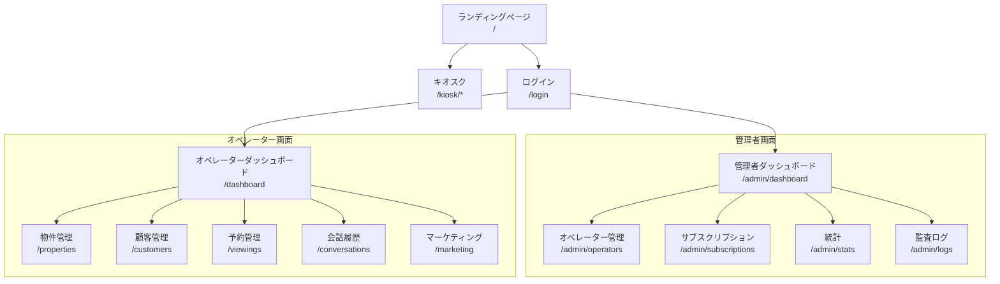

# 画面構成一覧

**案件名:** 不動産AIエージェントシステム（madoguchi-ai）
**発行日:** 2025年12月7日
**バージョン:** 1.0
**作成者:** 小松原遼羽

---

## 1. 画面構成サマリー

| カテゴリ | 画面数 | 対象ユーザー |
|---------|--------|-------------|
| 共通 | 3 | 全ユーザー |
| キオスク | 1（5フェーズ） | 来店客 |
| オペレーター管理 | 12 | オペレーター |
| システム管理者 | 10 | システム管理者 |
| **合計** | **26** | |

---

## 2. 共通画面（3画面）

### 2.1 ランディングページ

| 項目 | 内容 |
|------|------|
| パス | `/` |
| 目的 | サービス紹介 |
| 主な要素 | サービス説明、特徴紹介、お問い合わせリンク |
| アクセス権限 | 誰でも閲覧可能 |

### 2.2 ログイン画面

| 項目 | 内容 |
|------|------|
| パス | `/login` |
| 目的 | オペレーター・管理者の認証 |
| 主な要素 | メールアドレス入力、パスワード入力、ログインボタン |
| アクセス権限 | 未認証ユーザー |

### 2.3 エラーページ

| 項目 | 内容 |
|------|------|
| パス | `/error`、`/404`、`/500` |
| 目的 | エラー表示 |
| 主な要素 | エラーメッセージ、トップへ戻るボタン |
| アクセス権限 | 誰でも閲覧可能 |

---

## 3. キオスク画面（1画面・5フェーズ）

### 3.1 キオスクAI接客画面

| 項目 | 内容 |
|------|------|
| パス | `/kiosk/[operatorId]` |
| 目的 | 来店客がAIと会話して物件検索・内見予約 |
| アクセス権限 | 認証不要 |

#### フェーズ遷移図

#### 各フェーズの詳細

| フェーズ | 説明 | 主な要素 |
|---------|------|---------|
| **Welcome** | 初期画面 | AIアバター、「タップして開始」 |
| **Conversation** | メイン会話 | チャット、物件カード、音声入力ボタン |
| **Contact** | 連絡先入力 | 名前、電話番号、メールアドレス入力フォーム |
| **Complete** | 完了 | 予約サマリー、「ありがとうございました」 |
| **Goodbye** | 予約なし終了 | 「またのご来店をお待ちしています」 |

---

## 4. オペレーター管理画面（12画面）

### 4.1 ダッシュボード

| 項目 | 内容 |
|------|------|
| パス | `/dashboard` |
| 目的 | オペレーターの業務状況を一目で確認 |
| 主な要素 | 本日の予約数、新規顧客数、物件数、最近の会話 |

### 4.2 物件管理

| パス | 画面名 | 主な要素 |
|------|--------|---------|
| `/properties` | 物件一覧 | 物件カード、フィルター、検索、ページネーション |
| `/properties/[id]` | 物件詳細 | 物件情報、編集ボタン、削除ボタン |
| `/properties/create` | 物件登録 | 入力フォーム、画像アップロード |

### 4.3 顧客管理

| パス | 画面名 | 主な要素 |
|------|--------|---------|
| `/customers` | 顧客一覧 | 顧客リスト、検索、フィルター |
| `/customers/[id]` | 顧客詳細 | 顧客情報、会話履歴、予約履歴 |

### 4.4 内見予約管理

| パス | 画面名 | 主な要素 |
|------|--------|---------|
| `/viewings` | 予約一覧 | カレンダー表示、リスト表示、ステータスフィルター |
| `/viewings/[id]` | 予約詳細 | 予約情報、顧客情報、ステータス変更 |

### 4.5 会話履歴

| パス | 画面名 | 主な要素 |
|------|--------|---------|
| `/conversations` | 会話一覧 | 会話リスト、日付フィルター |
| `/conversations/[id]` | 会話詳細 | メッセージ履歴、提案物件、予約結果 |

### 4.6 マーケティング

| パス | 画面名 | 主な要素 |
|------|--------|---------|
| `/marketing/campaigns` | キャンペーン一覧 | キャンペーンリスト、配信統計 |
| `/marketing/campaigns/[id]` | キャンペーン詳細 | 配信設定、対象顧客、配信結果 |

---

## 5. システム管理者画面（10画面）

### 5.1 管理者ダッシュボード

| 項目 | 内容 |
|------|------|
| パス | `/admin/dashboard` |
| 目的 | システム全体の状況を確認 |
| 主な要素 | オペレーター数、総物件数、総顧客数、直近30日の会話数 |

### 5.2 オペレーター管理

| パス | 画面名 | 主な要素 |
|------|--------|---------|
| `/admin/operators` | オペレーター一覧 | 企業リスト、ステータス、統計 |
| `/admin/operators/[id]` | オペレーター詳細 | 企業情報、サブスクリプション、利用統計 |
| `/admin/operators/create` | オペレーター登録 | 企業情報入力、プラン選択 |

### 5.3 サブスクリプション管理

| パス | 画面名 | 主な要素 |
|------|--------|---------|
| `/admin/subscriptions` | サブスクリプション一覧 | 契約リスト、ステータス |
| `/admin/subscriptions/[id]` | サブスクリプション詳細 | 契約情報、プラン変更、解約 |

### 5.4 統計

| パス | 画面名 | 主な要素 |
|------|--------|---------|
| `/admin/stats` | 全体統計 | グラフ、KPI |
| `/admin/stats/operators` | オペレーター別統計 | 比較表、ランキング |

### 5.5 監査ログ

| 項目 | 内容 |
|------|------|
| パス | `/admin/logs` |
| 目的 | システム操作履歴の確認 |
| 主な要素 | 操作ログ、日付フィルター、操作種別フィルター |

### 5.6 システム設定

| 項目 | 内容 |
|------|------|
| パス | `/admin/settings` |
| 目的 | システム全体の設定変更 |
| 主な要素 | デフォルト設定、通知設定、API設定 |

---

## 6. 画面遷移図（概要）

---

## 7. レスポンシブ対応

| 画面カテゴリ | PC | タブレット | スマートフォン |
|------------|-----|----------|--------------|
| キオスク | ○ | ○（メイン） | △（簡易表示） |
| オペレーター管理 | ○（メイン） | ○ | △ |
| システム管理者 | ○（メイン） | ○ | △ |

---

## 8. 承認

本画面構成一覧の内容について確認・承認いたします。

| 項目 | 内容 |
|------|------|
| 発注者 | 株式会社ギヤマン |
| 署名 | __________________ |
| 日付 | ____年____月____日 |

| 項目 | 内容 |
|------|------|
| 受注者 | 小松原遼羽 |
| 署名 | __________________ |
| 日付 | ____年____月____日 |
